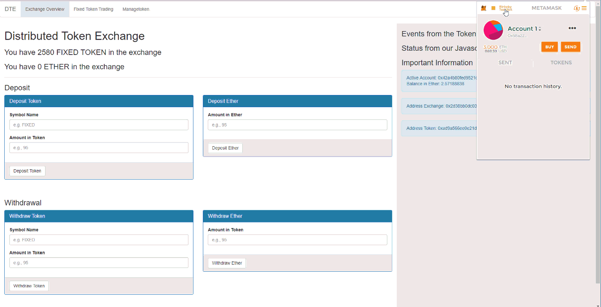

# Ethereum Distributed Token Exchange

Token-Exchange with MetaMask and the Rinkeby Test-Net



The Exchange Smart-Contract has 3 functions:
1. Funding: It's possible to deposit and withdraw both _tokens_ of any kind and Ether
2. Trading: You can trade any kind of token against ether. Both market orders and limit orders. It's also possible to cancel an order.
3. Manangement: It's possible to add new tokens on the fly.

The Exchange is unit tested with Truffle's Test-Framework.

All of this is also shown in the Course!


# Necessary Software

In order to work with the smart contracts and for the course you need

1. the Node Package Manager
2. Truffle
3. Ethereumjs-TestRPC
4. Geth
5. MIST
6. MetaMask
7. The Chome-Browser
8. On windows eventually the Git-Bash


1. Download necessary tools
```
npm install -g truffle
```

2. Download this repository:
```
git clone https://github.com/tomw1808/distributed_exchange_truffle_class_3.git
cd  "Practical Part 11 - FINAL Project"
```

3. With a running Ethereum Blockchain Node in the background (such as the ethereumjs-testrpc) do
```
truffle migrate
npm run dev
```


# About me
If you are interested about my work, checkout my website: [https://luisfcyafar.tk](https://luisfcyafar.tk)
